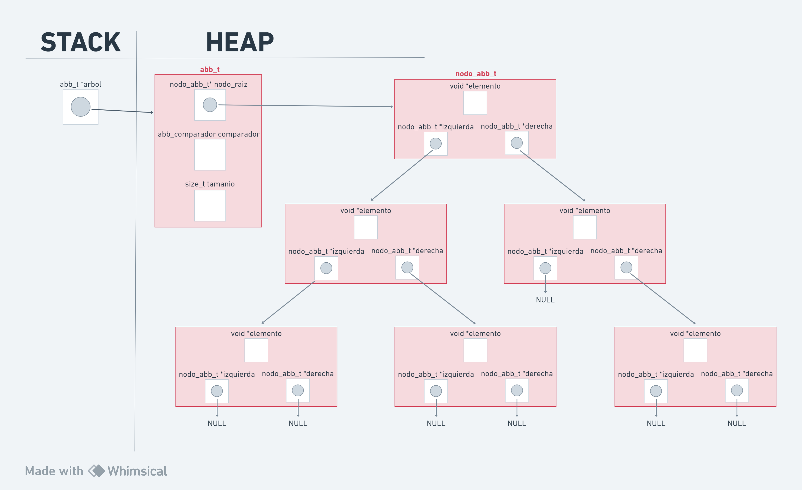
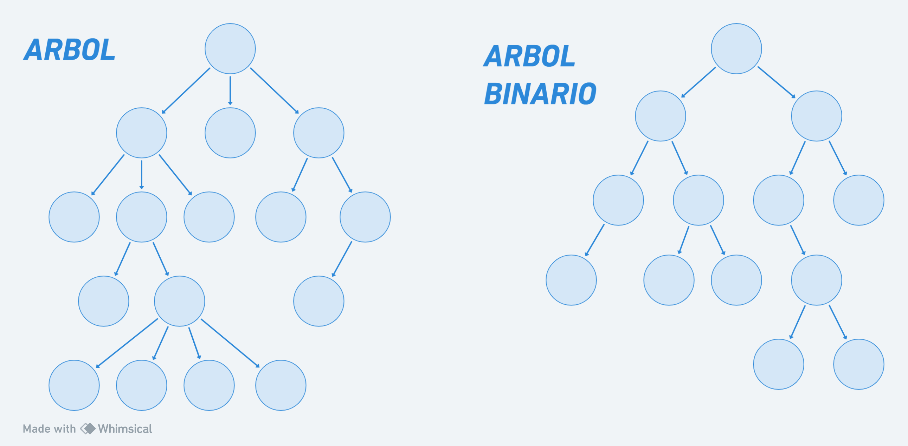

# TDA ABB

## Repositorio de (Nombre Apellido) - (Padrón) - (Mail)

- Para compilar:

```bash
make pruebas_chanutron
```

- Para ejecutar:

```bash
./pruebas_chanutron
```

- Para ejecutar con valgrind:
```bash
make valgrind-chanutron
```
---
##  Funcionamiento

Este tda basicamente se encarga de implementar todas las funcionalidades para el uso de un Arbol de Busqueda Binario (ABB), a partir de las funciones basicas que se deben hacer para que el ABB funcione correctamente, paso a explicar que hace cada funcion:

`abb_crear`: reserva la memoria necesaria para crear un abb, recibe un comparador que se inserta en el abb y se retorna el abb creado. si el comparador recibido es nulo, la funcion devolvera NULL.

`abb_insertar`: recibe un abb y un elemento, el objetivo que tiene es insertar el elemento en la posicion correcta del abb, para hacer esto se recorre recursivamente el nodo hasta encontrar la posicion correcta, luego se reserva espacio en memoria para un nodo, se inserta el elemento en el nodo creado y se "conecta" el nodo en el abb.
luego se retorna el abb con el nuevo nodo incluido en el mismo.
si recibe un arbol nulo, devuelve nulo.
la complejidad de esta funcion es O(n)

`abb quitar`: recibe un abb y el elemento que se quiere eliminar.
en caso de que el arbol sea nulo o este vacia, retornara NULL.
en forma recursiva se recorre el arbol hasta encontrar el elemento a eliminar (si no se encuentra, el abb se mantiene igual),
si el elemento a eliminar no tiene hijos, se elimina directarmente.
si tiene un hijo, se elimina y tambien se conecta al padre del nodo eliminado con el hijo del nodo eliminado.
si tiene dos hijos, el elemento eliminado es suplantado por su predecesor inorden (de esto se encargar la funcion `extraer_predecesor_inoden`).
en los 3 casos se libera la memoria del nodo eliminado.
la complejidad es O(log(n)).

`abb_buscar`: se recibe un arbol y un elemento, se busca el elemento en el arbol. si el arbol es nulo se devuelve null, sino se devuelve el elemento encontrado o null en caso de que no se encuentre.
se usa una busqueda recursiva para buscar el elemento.
la complejidad es O(log(n))

`abb_vacio`: funcion booleana que recibe un arbol y devuelve true si este esta vacio o es nulo, en caso de que tenga elemento devuelve false.

`abb_tamanio`: recibe un arbol y devuelve el tamanio del mismo.

`abb_con_cada_elemento`: recorre el arbol y aplica una funcion booleana a los elementos, si la funcion devuelve false, deja de recorrer. devuelve la cantidad de veces que se aplico la funcion.
esta funcion recibe el arbol, el tipo de recorrido que se debe realizar, la funcion que se le debe aplicar a los elementos y un auxiliar para usar en la funcion.
segun el recorrido, se invoca a la funcion `con_cada_inorden` , `con_cada_preorden` o `con_cada_postorden`, en estas funciones se recorre el abb de forma recursiva, aplicando la funcion booleana y cortando el recorrido en caso de que la funcion devuelva false.
si el arbol o la funcion son nulas, se devuelve 0.
la complejidad es O(n).

`abb_recorrer`: se recorre el arbol y se van guardando los elementos en el array recibido.
se recibe el arbol, el tipo de recorrido a realizar, el vector y el tamaño de este vector. 
el abb se recorrera segun el tipo recibido, de forma recursiva, y se iran guardando los elementos en el array. en caso de que el array se llene, se dejaran de guardar los elementos en el mismo.
la funcion devuelve la cantidad de vectores que se guardaron en el array.
la funcion devuelve 0 en caso de que el arbol sea nulo o este vacio, si el array es nulo o si recorrido no es de alguno de los 3 tipos validos.
la complejidad es O(n).

`abb_destruir` y `abb_destruir_todo`: estas funciones son muy similares, ambas utilizan la funcion `abb_destruir_raices` para liberar la memoria de los nodos y luego liberan la memoria del abb.
la diferencia es que `abb_destruir_todo` recibe una funcion destructora, que se pasa por parametro a la funcion `abb_destruir_raices` y se encarga de destruir los elementos de los nodos, cosa que `abb_destruir` no hace.

DIAGRAMA DE MEMORIA DEL ABB:
<div align="center">

</div>

---

## Respuestas a las preguntas teóricas

RESPUESTA 1:


Arbol: Un arbol esta conformado por nodos conectados entre si, inicia con el nodo raiz y este apunta a cero o mas subarboles no vacios (ver diagrama)
Los arboles son muy utiles para representar una jerarquia en la estructura de datos y optimizar mucho la busqueda de elementos dentro del mismo.
Para cantidades muy grandes de datos, la busqueda lineal (O(n)) puede no ser muy eficiente, por eso se crearon los arboles, estos reducen el tiempo de busqueda a (O(log(n)), ya que al comparar el elemento buscado con la raiz, se termina descartando un lado (izq o der) entero, ahorrando asi mucho tiempo y siendo mas eficiente.

Arbol Binario: el arbol binario es un tipo de arbol que tiene como caracteristica principal que cada nodo puede tener como maximo 2 hijos, teniendo asi la nocion de izquierda y derecha. esto es muy util para realizar busquedas.

Arbol Binario de Busqueda (ABB): el ABB es un arbol que, como dice su nombre, se usa para almacenar datos y poder buscarlos de manera rapida y eficiente, usando un algoritmo similar al de la busqueda binaria. Es muy importante que sea binario, ya que al tener el concepto de parte izquierda y parte derecha, se puede compara el elemento con la raiz, ver si es mayor o menor y, segun el caso, continuar buscando por el subarbol izquierdo o el subarbol derecho.
En el abb, los elementos menores se insertan a la izquierda y los mayores a la derecha.

DIAGRAMAS ARBOL y ABB:

<div align="center">

</div>

-

las operaciones basicas de un abb son:
- crear: crea el arbol reservandole lugar en memoria.
- destruir: destruye el arbol, liberando la memoria de todos los nodos que hay en el, y luego liberando el arbol. complejidad O(n), ya que recorre todos los nodos para liberarlos.
- vacio: chequea si el arbol esta o no esta vacio. complejidad O(1), ya que el arbol incluye un contador con la cantidad de nodos
- insertar: inserta un elemento nuevo en el arbol, la complejidad es O(log(n)), ya que busca el lugar donde se debe insertar el elemento y luego lo inserta.
- eliminar: elimina un elemento del arbol, si no tiene hijos lo hace directamente, si tiene un hijo conecta al padre del elemento eliminado con el hijo del mismo, y si tiene dos hijos reemplaza el elemento eliminado por su predecesor inorden. su complejidad es O(log(n))
- buscar: busca un elemento en el arbol, su complejidad es O(log(n)) ya que realiza una busqueda binaria
- recorrer: recorre todo el arbol, puede hacer de forma Inorden, Preorden o Postorden. su complejidad es O(n)


RESPUESTA 2:
Yo en mi implementacion decidi realizar todo de manera recursiva, ya que me parecio la forma mas sencilla de hacer. Tuve algunas complicaciones, no para manejo de nodos, punteros y memoria, sino mas bien para plantear las recursividades, pero logre realizarlas y que funcionen correctamente (las funciones ya las explique en la parte de funcionamiento). creo que este tda me ayudo a entender mucho mas el tema de recursividad.
